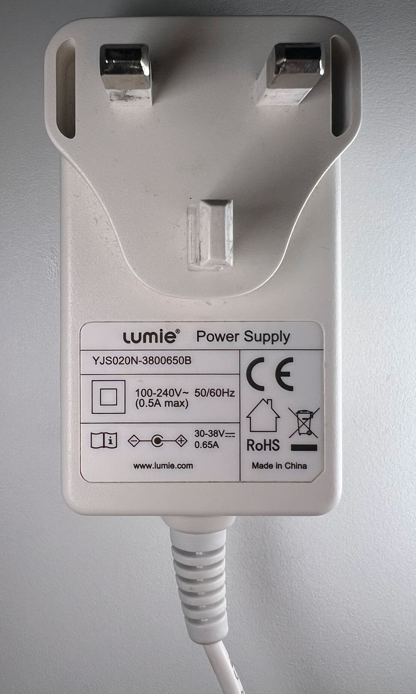

# Lumie Vitamin L Disassembly

Lumie Vitamin L dissasembly. Please don't follow this if you not comfortable with electronics. This is not a manual. Everything included is for educational purpouses only.

## Table of Contents

- [Request for Comments](#rfc)
- [Lamp](#lamp)
- [Screws](#screws)
- [LED strip (it's on both sides)](#led)
- [The control board it on the back](#control)
- [Lable](#lable)
- [Power supply](#power)
- [Power Plug](#plug)

## RFC
### Request for Comments

I'm not sure how to get into the back PCB with the power button. Let me know how to do it non distructively.

---
---

## Lamp

## Screws

There is tonnes of glue all around the edges. I managed to lift the front panel with three credit card plastic tools.

## LED
### LED strip (it's on both sides)

## Control
### The control board it on the back

It's impossible to get into the controll board from the inside, which is probably a good design. However, I have no clue how to get into it from outside, either.

## Lable

## Power 
### Supply

## Plug  
### (6mm)

